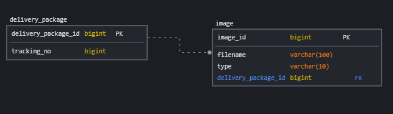

# 서버 CPU 사용률 모니터링 시스템

## 활용 기술

- Spring Boot 3.3.0
- Java 21
- JPA
- Swagger
- JUnit
- gradle
- MySQL
- H2

## ERD

### 작업내용

- 패키지 저장
  - 동시성 제어의 경우 db에서 trackingNo를 unique로 설정하여 db의 기본기능으로 제어
- 패키지 조회
  - 전체 조회(페이지는 미구현)
  - ID, trackingNo로 패키지 조회
- 패키지 삭제
  - ID로 패키지 삭제
- 이미지 추가 및 제거
  - 패키지의 이미지를 1개 추가 및 제거
- 로그 처리
  - logback을 이용하여 로그를 처리
  - 로컬과 테스트 환경에서는 콘솔에 로그를 출력하고, 운영 환경에서는 AWS CloudWatch와 파일에 로그를 저장

### 접속 정보
- 어플리케이션 : http://www.jongin.site:8090
- 스웨거 : http://www.jongin.site:8090/swagger-ui/index.html